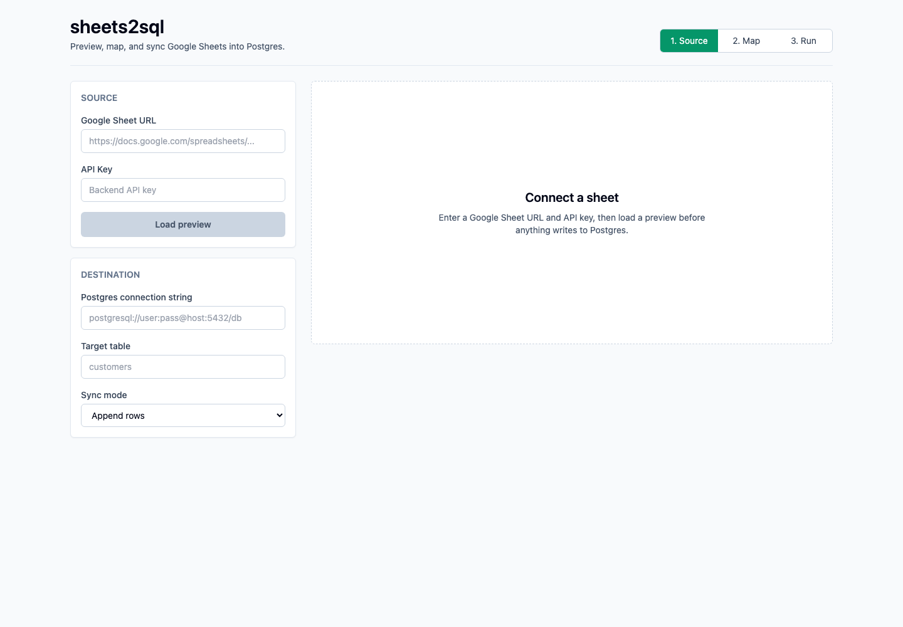
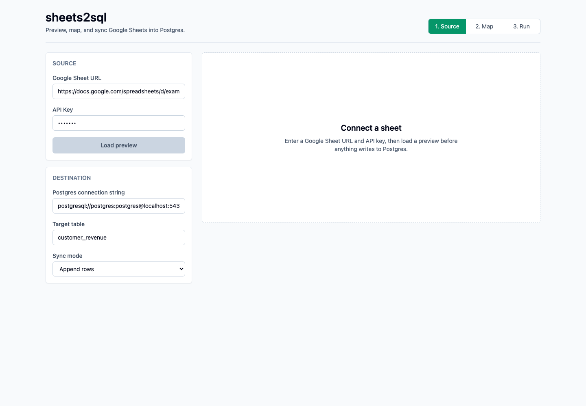
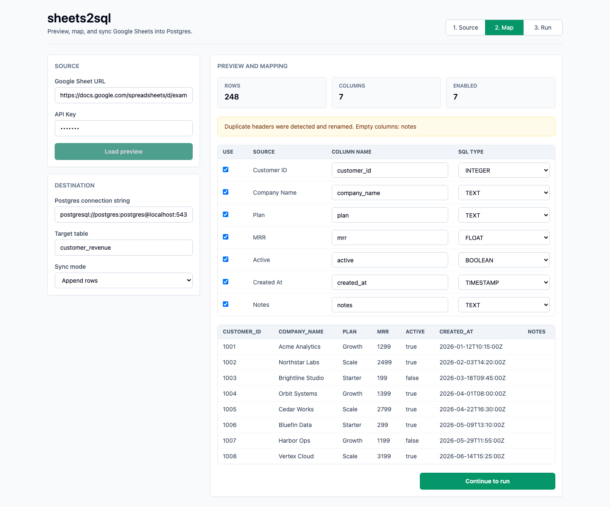
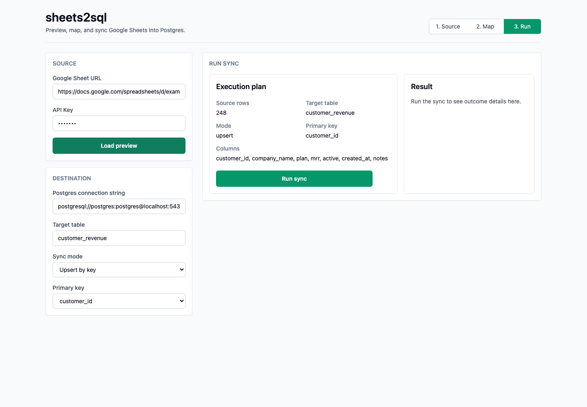
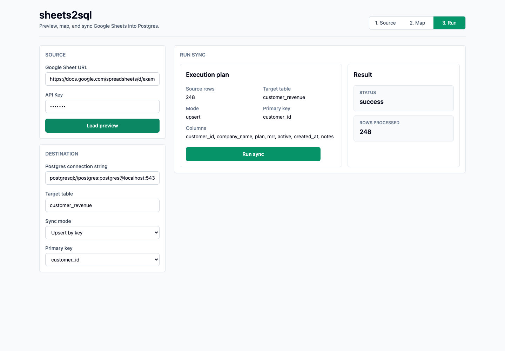

# sheets2sql

A lightweight ETL web service to sync data from Google Sheets to PostgreSQL.


## Quickstart

### 1. Clone the repository

```sh
git clone <your-repo-url>
cd extracto
```

### 2. Prepare environment variables

Copy the example environment files and edit them with your credentials:

```sh
cp backend/.env.example backend/.env
cp frontend/.env.example frontend/.env
# Edit backend/.env and frontend/.env in your editor
```

- **API_KEY**: Set a secret key for authenticating requests (use the same value in frontend and backend).
- **GOOGLE_API_KEY**: (Optional) For Google Sheets API if using API key auth. For service account, place your credentials JSON in the backend and update code as needed.
- **POSTGRES_CONNECTION_STRING**: Example: `postgresql://postgres:postgres@db:5432/sheets2sql`

### 3. Install Docker & Docker Compose

Make sure you have [Docker Desktop](https://www.docker.com/products/docker-desktop/) installed and running.

### 4. Build and start the services

```sh
docker-compose up --build
```

This will start:
- **Backend** (FastAPI): http://localhost:8000
- **Frontend** (Next.js): http://localhost:3000
- **Postgres**: http://localhost:5432 (internal)


### 5. Use the workflow

Open [http://localhost:3000](http://localhost:3000). The app walks through three steps:

1. **Source**: Enter a Google Sheet URL and the backend API key.
2. **Map**: Preview rows, review detected columns, rename columns, choose SQL types, and disable columns you do not want to sync.
3. **Run**: Choose the sync mode, confirm the execution plan, and run the sync into Postgres.

#### Source

Start with the Sheet URL and API key. Add the destination connection string and target table before running a sync.





#### Preview and map

Click **Load preview** to inspect the first worksheet before writing anything to Postgres. The preview shows row count, column count, warnings, inferred SQL types, editable destination column names, and sample rows.



#### Run sync

Choose one of the sync modes:

- **Append rows**: Insert all rows into the target table.
- **Replace table**: Drop and recreate the target table before inserting rows.
- **Upsert by key**: Insert rows or update existing rows using the selected primary key.

Review the execution plan, then click **Run sync**.



After the sync finishes, the result panel shows status and rows processed.



#### Troubleshooting

If you see errors, check:

- The API key matches in both frontend and backend.
- The Google Sheet is accessible by the configured Google service account.
- `gspread` can find service account credentials, usually at `~/.config/gspread/service_account.json`.
- The Postgres connection string is correct.
- Backend logs include the detailed error.

### 6. Stopping the app

Press `Ctrl+C` in your terminal, then run:
```sh
docker-compose down
```

## Development
- Backend: FastAPI in `/backend`
- Frontend: Next.js + Tailwind in `/frontend`

## Deployment
- See `docker-compose.yml`, `vercel.json`, and `render.yaml` for cloud options.

## License
MIT
